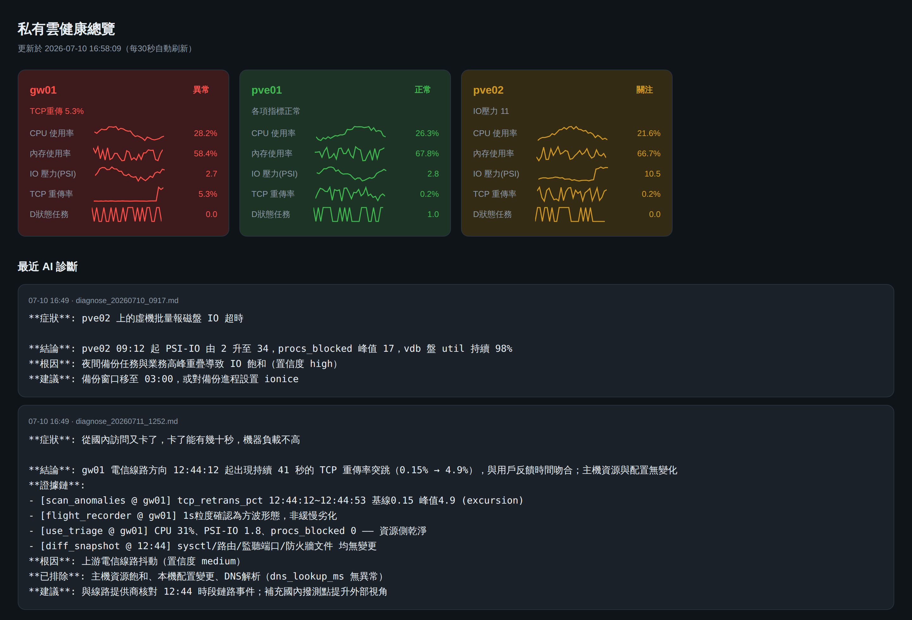
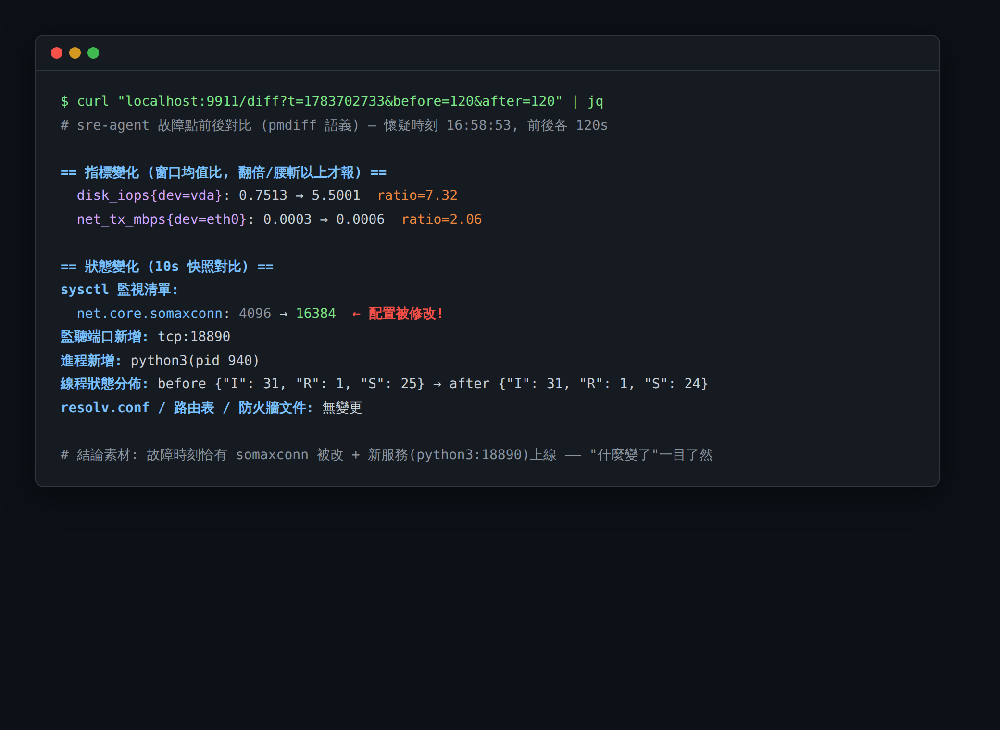

# AI-SRE Agent

> **不是又一个监控面板。** 用户说"从国内访问又卡了，卡了几十秒，负载不高"——
> 系统自己去查、自己收窄假设，给出带时间对齐证据链的根因。

**闭环 AI 根因诊断**：Claude 在 agentic 循环里自主决定调用哪个只读工具
（假设 → 取证 → 收窄），底层是 5MB 单二进制采集器 + 飞行记录器 + pmdiff 式前后对比。
方法论来自 Brendan Gregg（USE / TSA / 60秒排查）、PCP pmdiff 与 Google SRE。


*boss-board：红黄绿一眼看懂，下方直接滚动 AI 诊断结论*


*`/diff`：故障时刻前后"什么变了"——sysctl 被改、新端口、新进程，全部抓出（真机实测）*

## 亮点

- **AI 是主体，不是总结器**：6 个只读工具供 Claude 自主编排调用，强制证据引用，
  步数预算内收敛不了就明说缺什么观测手段
- **飞行记录器**：1s 原始粒度内存环形缓冲保留 1 小时——几十秒的间歇性卡顿
  在 10s 聚合曲线上会被平均掉，在这里躲不掉
- **pmdiff 语义的 /diff**：指标窗口均值比 + 进程/线程状态/sysctl/路由/端口/
  防火墙文件快照对比，"什么变了"优先于"什么坏了"
- **极致足迹**：agent 为 Go 纯标准库单二进制 5.4MB / RSS 9MB / 零 exec 只读采集；
  brain 为 Ruby 零 gem；boss-board 单二进制零 CDN（纯内网可用）

## 架構

```
                        「又卡了」(飛書/CLI)
                              │
                              ▼
                 ┌───────────────────────────┐
                 │  brain/ (Ruby, 零依賴)      │
                 │  Claude tool-use 閉環:      │
                 │  假設→取證→收窄→結論        │
                 └──┬──────┬──────┬──────┬───┘
          get_topology  use_triage  scan_anomalies  flight_recorder
                 │        │(60s排查) │(曲線→事件)    │(1s原始粒度)
                 ▼        ▼          ▼               ▼
          topology.yml  ┌────────────────┐   ┌──────────────────┐
          (環境知識)     │ VictoriaMetrics │◄──│ sre-agent (Go)    │
                        │ 10s聚合歷史,90d │push│ 5.3MB二進制/9MB RSS│
                        └────────────────┘   │ 1s環形緩衝(1h)     │
                                             │ /proc直讀,零exec   │
                                             └──────────────────┘
```

## 設計原則（Brendan Gregg 方法論的工程化）

- **USE 方法是數據模型**：agent 每類資源必採 Utilization / Saturation / Errors。
  PSI（/proc/pressure）提供真正的 saturation——「負載不高但很卡」正是 PSI 的用武之地。
- **60 秒排查是 AI 的第一個工具**：`/triage` 端點就是 Gregg 60-second checklist 的
  自動化版，模型第一步調它建立全局印象，而不是漫無目的翻曲線。
- **曲線不進上下文，事件才進**：`scan_anomalies` 用穩健 z-score（median/MAD）+
  突變檢測把時序壓成「何時、何指標、偏離多少、持續多久」的事件，AI 引用事件做因果推理。
- **飛行記錄器抓間歇性問題**：歷史庫是 10s 聚合，幾十秒的卡頓會被平均掉；agent
  內存裡保留最近 1 小時的 1s 原始粒度，診斷時按需拉取異常窗口。同時所有聚合指標
  帶 `_max` 系列保尖峰。
- **量化，不猜**：system prompt 強制每條結論引用具體數字與時間戳，時間對不齊的
  假設不成立；定位不到就明說排除了什麼、缺什麼觀測手段。
- **全鏈路只讀**：agent 無 exec、無寫入、systemd 加固（ReadOnlyPaths=/）；
  brain 的工具全是查詢；每次工具調用寫審計日誌。

## 部署（三步）

```bash
# 1. 數據節點: 裝 VictoriaMetrics
bash platform/install_vm.sh

# 2. 每台目標主機: 裝 agent（交叉編譯一次到處跑）
cd agent && CGO_ENABLED=0 go build -ldflags="-s -w" -o sre-agent .
scp sre-agent host:/usr/local/bin/
scp sre-agent.service host:/etc/systemd/system/   # 改 DATA_NODE_IP
ssh host systemctl enable --now sre-agent

# 3. 診斷節點: 配置 brain
cp config.example.yml config.yml        # 填 VM 地址、飛書 webhook
vim platform/topology.yml               # 維護你的環境知識（重要!）
export ANTHROPIC_API_KEY=sk-ant-xxx

# 診斷
ruby brain/diagnose.rb "從國內訪問又卡了，卡了能有幾十秒，機器負載不高"
```

## 故障點前後對比（/diff，pmdiff 語義）

`GET /diff?t=<懷疑時刻unix秒>&before=120&after=120&q=2`，一次調用返回：

- **指標對比**（算法照抄 PCP pmdiff）：t 前後兩窗口每指標均值比，默認只報
  翻倍/腰斬以上；基線 0 → 非 0 記 `|+|`，反之 `|-|`；按變化幅度排序；
  單側才有的指標單獨列出
- **狀態對比**（Google SRE「變更監控」清單落地，每 10s 快照，內存保留 1h）：
  進程出現/消失（排除內核線程噪音）、線程總數與 R/S/D 狀態分佈變化（TSA-lite，
  D 激增 = IO/鎖等待）、sysctl 監視清單變更、resolv.conf / 路由表 / 監聽端口 /
  防火牆配置文件變更
- **DNS 主動探測**：`-dns domain1,domain2` 啟用，走本機真實解析路徑，
  產出 dns_lookup_ms / dns_fail 進入常規指標流

brain 對應新增 `diff_snapshot` 工具；system prompt 寫入「什麼變了優先於
什麼壞了」與「相關不等於因果」（SRE book 第 12 章）原則。

## 方法論出處

- USE / TSA / 60 秒排查：Brendan Gregg（brendangregg.com/usemethod, tsamethod）
- 前後窗口對比：PCP pmdiff（man 1 pmdiff；閾值、|+|/|-|、速率化語義照抄）
- 變更監控清單、因果警告：Google SRE Book ch.12 & SRE Workbook Monitoring

## 已驗證（本倉庫代碼在容器內實測）

- agent 編譯即 5.4MB 靜態二進制，實測 RSS 9.2MB，/triage、/window、/diff 正常
- 異常事件化：41 秒方波突跳精確檢出（基線 0.113 → 峰值 8.35），平穩曲線零誤報
- /diff 注入實測：sysctl 變更（somaxconn 4096→8192）、新監聽端口、新進程
  三處全部抓出；內核線程進出 top-N 的噪音已修復
- 五個診斷工具端到端全通（真 agent + 模擬歷史庫）

## 路線圖（按價值排序）

1. **netlink TCP_INFO 按前綴聚合**（agent v2 核心）：inet_diag 批量拉全機連接的
   rtt/retrans，按「國內電信/聯通/日本本地」前綴組聚合成 `tcp_rtt_p99{prefix_group=}`。
   這直接補上「用戶說卡但服務端指標全綠」的觀測盲區——你那個場景的關鍵一塊。
2. **飛書機器人入口**：群裡 @機器人描述症狀 → 觸發 diagnose → 卡片回覆
   （複用你 Sinatra + 回調那套）。
3. **案例記憶**：每次診斷的「症狀→根因→證據路徑」歸檔，新診斷先檢索相似案例；
   結論性的環境怪癖沉澱進 topology.yml 的 known_quirks。
4. **eBPF 深挖工具**：tcp_retransmit_skb / qdisc drop 事件級觀測（CO-RE，
   復用你 TOA 模組趟過的 BTF 跨版本方案），作為 brain 的按需取證工具而非常駐採集。
5. **日誌工具**：journald/rsyslog 集中後加一個 `search_logs` 工具，讓證據鏈
   能同時引用指標事件和日誌行。
