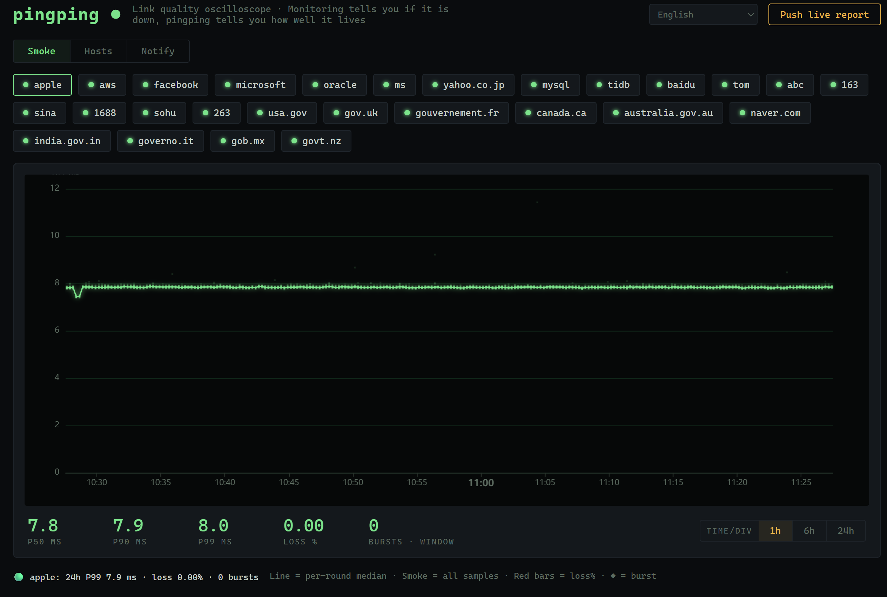

🌐 **[English](#english)** · [中文](#中文) · [日本語](#日本語) · [한국어](#한국어) · [Deutsch](#deutsch) · [Français](#français) · [Español](#español) · [Português](#português) · [Italiano](#italiano) · [Русский](#русский) · [ไทย](#ไทย) · [Bahasa Indonesia](#bahasa-indonesia) · [Tiếng Việt](#tiếng-việt) · [العربية](#العربية)




open [Releases](https://github.com/githubflyideas/pingping/releases) 
```bash
tar xzf pingping-v*-linux-amd64.tar.gz && cd pingping-*/
./pingping
```
English

PingPing is a lightweight network latency and link quality visualization tool.

It may not be as powerful or feature-rich as Smokeping, but it's ridiculously lightweight.

Single binary
No Docker
No make. Just scp and run.
No database
Plain text configuration. Edit targets with your favorite editor—or even a single echo command.

Download it, extract it, run ./pingping, then go grab a coffee.

When you're back, open http://localhost:8517 and watch your first puff of network smoke.

PingPing 是一款輕量級的網路鏈路品質繪圖工具。
它或許沒有 Smokeping 那麼強大、成熟，但它足夠輕巧。

單一執行檔（Single Binary），下載即可使用
無需 Docker
無需 Root 權限
無需資料庫
使用純文字設定檔，可用任何文字編輯器修改監控目標，甚至一行 echo 指令即可完成。

下載、解壓、執行 ./pingping，然後去泡杯咖啡吧。回來打開 http://localhost:8517，看看你的第一縷網路煙霧！


Español

PingPing es una herramienta ligera para visualizar la calidad de enlaces de red.

Puede que no sea tan potente ni tan completa como Smokeping, pero es extremadamente ligera.

Un único ejecutable
Sin Docker
Sin make. Solo copia con scp y ejecútalo.
Sin base de datos
Configuración en texto plano. Puedes editar los objetivos con cualquier editor, o incluso con un simple comando echo.

Descárgalo, descomprímelo y ejecuta ./pingping. Luego ve a prepararte un café.

Cuando vuelvas, abre http://localhost:8517 y disfruta de tu primera nube de humo de red.

Français

PingPing est un outil léger de visualisation de la qualité des liaisons réseau.

Il n'est peut-être pas aussi puissant ni aussi complet que Smokeping, mais il est incroyablement léger.

Un seul exécutable
Aucun Docker
Pas de make. Un simple scp, puis exécutez-le.
Aucune base de données
Configuration en texte brut. Modifiez les cibles avec votre éditeur préféré, ou même avec une simple commande echo.

Téléchargez-le, décompressez-le et lancez ./pingping.

Allez ensuite vous préparer un café.

À votre retour, ouvrez http://localhost:8517 et admirez votre premier nuage de fumée réseau.

Português

PingPing é uma ferramenta leve para visualizar a qualidade das ligações de rede.

Talvez não seja tão poderoso quanto o Smokeping, mas é extremamente leve.

Binário único
Sem Docker
Sem make. Basta copiar com scp e executar.
Sem banco de dados
Configuração em texto simples. Edite os alvos com qualquer editor ou até mesmo com um único comando echo.

Baixe, extraia e execute ./pingping.

Depois vá tomar um café.

Quando voltar, abra http://localhost:8517 e veja a sua primeira fumaça da rede.

Deutsch

PingPing ist ein leichtgewichtiges Werkzeug zur Visualisierung der Netzwerkqualität.

Es ist vielleicht nicht so leistungsfähig wie Smokeping, dafür aber extrem schlank.

Eine einzige ausführbare Datei
Kein Docker
Kein make. Einfach per scp kopieren und starten.
Keine Datenbank
Konfiguration als Textdatei. Ziele lassen sich mit jedem Editor oder sogar mit einem einzigen echo-Befehl bearbeiten.

Herunterladen, entpacken und ./pingping starten.

Dann gönn dir einen Kaffee.

Wenn du zurückkommst, öffne http://localhost:8517 und sieh dir deine erste Netzwerk-Rauchwolke an.

Русский

PingPing — лёгкий инструмент для визуализации качества сетевых соединений.

Возможно, он не такой мощный, как Smokeping, но зато невероятно лёгкий.

Один исполняемый файл
Без Docker
Без make. Просто скопируйте через scp и запустите.
Без базы данных
Текстовый файл конфигурации. Цели можно редактировать любым редактором или даже одной командой echo.

Скачайте, распакуйте и запустите ./pingping.

А затем сходите выпить кофе.

Вернувшись, откройте http://localhost:8517 и посмотрите на своё первое «сетевое облако дыма».


PingPing は、軽量なネットワーク品質可視化ツールです。

Smokeping ほど高機能ではありませんが、その代わり驚くほど軽量です。

単一バイナリ
Docker 不要
make 不要。scp して実行するだけ。
データベース不要
設定ファイルはプレーンテキスト。お好みのエディタで編集でき、echo 一行でも監視対象を追加できます。

ダウンロードして展開し、./pingping を実行したら、コーヒーでも淹れましょう。

戻って http://localhost:8517 を開けば、最初のネットワークスモークグラフが待っています。

한국어

PingPing은 가벼운 네트워크 품질 시각화 도구입니다.

Smokeping만큼 강력하지는 않지만, 놀라울 정도로 가볍습니다.

단일 실행 파일
Docker 불필요
make 불필요. scp로 복사한 뒤 바로 실행.
데이터베이스 불필요
설정은 일반 텍스트 파일입니다. 원하는 편집기로 수정하거나 echo 한 줄만으로도 모니터링 대상을 추가할 수 있습니다.

다운로드하고 압축을 푼 뒤 ./pingping을 실행하세요.

그리고 커피 한 잔 마시고 돌아오세요.

돌아와 http://localhost:8517 를 열면 첫 번째 네트워크 스모크 그래프를 볼 수 있습니다.


Bahasa Indonesia

PingPing adalah alat ringan untuk memvisualisasikan kualitas koneksi jaringan.

Mungkin tidak sekuat Smokeping, tetapi sangat ringan.

Satu berkas biner
Tanpa Docker
Tanpa make. Cukup salin dengan scp lalu jalankan.
Tanpa basis data
Konfigurasi berbentuk teks biasa. Edit target dengan editor favorit Anda, atau bahkan cukup dengan satu perintah echo.

Unduh, ekstrak, lalu jalankan ./pingping.

Kemudian nikmati secangkir kopi.

Saat kembali, buka http://localhost:8517 dan lihat asap pertama jaringan Anda.

Tiếng Việt

PingPing là công cụ nhẹ để trực quan hóa chất lượng kết nối mạng.

Có thể nó không mạnh bằng Smokeping, nhưng cực kỳ gọn nhẹ.

Một tệp thực thi duy nhất
Không cần Docker
Không cần make. Chỉ cần scp rồi chạy.
Không cần cơ sở dữ liệu
Cấu hình bằng tệp văn bản thuần túy. Bạn có thể chỉnh sửa bằng bất kỳ trình soạn thảo nào, hoặc chỉ với một lệnh echo.

Tải về, giải nén và chạy ./pingping.

Sau đó hãy đi pha một tách cà phê.

Khi quay lại, mở http://localhost:8517 để xem làn khói mạng đầu tiên của bạn.

العربية

PingPing أداة خفيفة لعرض جودة اتصالات الشبكة.

قد لا تكون بنفس قوة Smokeping، لكنها خفيفة للغاية.

ملف تنفيذي واحد
لا حاجة إلى Docker
لا حاجة إلى make، فقط انسخه باستخدام scp ثم شغّله.
لا حاجة إلى قاعدة بيانات
إعدادات بنص عادي، ويمكن تعديل أهداف المراقبة بأي محرر نصوص، أو حتى بأمر echo واحد.

نزّل البرنامج، فك الضغط، ثم شغّل ./pingping.

بعدها اذهب لتحضير فنجان من القهوة.

وعند عودتك، افتح http://localhost:8517 وشاهد أول مخطط دخان للشبكة.

हिन्दी

PingPing एक हल्का नेटवर्क लिंक गुणवत्ता विज़ुअलाइज़ेशन टूल है।

यह Smokeping जितना शक्तिशाली नहीं हो सकता, लेकिन बेहद हल्का है।

एकल बाइनरी
Docker की आवश्यकता नहीं
make की आवश्यकता नहीं। बस scp करें और चलाएँ।
डेटाबेस की आवश्यकता नहीं
साधारण टेक्स्ट कॉन्फ़िगरेशन। अपनी पसंद के किसी भी संपादक से लक्ष्य बदलें, या केवल एक echo कमांड से।

डाउनलोड करें, अनज़िप करें और ./pingping चलाएँ।

फिर एक कप कॉफ़ी बना लीजिए।

वापस आकर http://localhost:8517 खोलें और अपना पहला नेटवर्क स्मोक ग्राफ़ देखें।

বাংলা

PingPing একটি হালকা নেটওয়ার্ক সংযোগের মান প্রদর্শনের টুল।

এটি Smokeping-এর মতো শক্তিশালী নাও হতে পারে, তবে অত্যন্ত হালকা।

একটি মাত্র বাইনারি
Docker প্রয়োজন নেই
make প্রয়োজন নেই। শুধু scp করে চালান।
ডাটাবেস প্রয়োজন নেই
সাধারণ টেক্সট কনফিগারেশন। যেকোনো টেক্সট এডিটর, এমনকি একটি echo কমান্ড দিয়েও মনিটরিং লক্ষ্য পরিবর্তন করা যায়।

ডাউনলোড করুন, আনজিপ করুন এবং ./pingping চালান।

তারপর এক কাপ কফি বানিয়ে আসুন।

ফিরে এসে http://localhost:8517 খুলুন এবং আপনার প্রথম নেটওয়ার্ক স্মোক গ্রাফ দেখুন।

اردو

PingPing نیٹ ورک لنک کے معیار کو دکھانے والا ایک ہلکا پھلکا ٹول ہے۔

یہ شاید Smokeping جتنا طاقتور نہ ہو، لیکن انتہائی ہلکا ہے۔

ایک واحد بائنری
Docker کی ضرورت نہیں
make کی ضرورت نہیں۔ صرف scp کریں اور چلائیں۔
ڈیٹابیس کی ضرورت نہیں
سادہ ٹیکسٹ کنفیگریشن۔ کسی بھی ایڈیٹر یا صرف ایک echo کمانڈ سے مانیٹرنگ اہداف تبدیل کیے جا سکتے ہیں۔

ڈاؤن لوڈ کریں، ان زپ کریں اور ./pingping چلائیں۔

پھر ایک کپ کافی بنا لیں۔

واپس آ کر http://localhost:8517 کھولیں اور اپنا پہلا نیٹ ورک اسموک گراف دیکھیں۔

Türkçe

PingPing, ağ bağlantısı kalitesini görselleştiren hafif bir araçtır.

Smokeping kadar güçlü olmayabilir, ancak son derece hafiftir.

Tek çalıştırılabilir dosya
Docker gerekmez
make gerekmez. scp ile kopyalayın ve çalıştırın.
Veritabanı gerekmez
Düz metin yapılandırması. Hedefleri istediğiniz düzenleyiciyle, hatta tek bir echo komutuyla bile değiştirebilirsiniz.

İndirin, arşivi açın ve ./pingping çalıştırın.

Sonra gidip bir kahve hazırlayın.

Geri döndüğünüzde http://localhost:8517 adresini açın ve ilk ağ duman grafiğinizi görün.

ภาษาไทย (Thai)

PingPing เป็นเครื่องมือขนาดเล็กสำหรับแสดงภาพคุณภาพของลิงก์เครือข่าย

อาจจะไม่ได้ทรงพลังหรือมีฟีเจอร์ครบถ้วนเทียบเท่า Smokeping แต่มีจุดเด่นคือความเบาและใช้งานง่ายอย่างมาก

ไฟล์ไบนารีเดียว (Single Binary)
ไม่ต้องใช้ Docker
ไม่ต้องใช้ make เพียง scp ไฟล์แล้วใช้งานได้ทันที
ไม่ต้องใช้ฐานข้อมูล
ใช้ไฟล์กำหนดค่าแบบข้อความธรรมดา สามารถแก้ไขเป้าหมายการตรวจสอบด้วยโปรแกรมแก้ไขข้อความใดก็ได้ หรือแม้แต่ใช้คำสั่ง echo เพียงบรรทัดเดียว

ดาวน์โหลด แตกไฟล์ แล้วรัน ./pingping

จากนั้นไปชงกาแฟสักแก้ว

เมื่อกลับมา เปิด http://localhost:8517 แล้วดูควันเครือข่ายเส้นแรกของคุณได้เลย


smokeping--- https://github.com/oetiker/SmokePing

- ⭐ Star 
- [GitHub Sponsors](https://github.com/sponsors/githubflyideas) 
## Design notes

pingping 2.0 is deliberately a **local, read-only oscilloscope**: probes go in, JSONL text files
sit on disk (300-day retention, deleted nightly), smoke graphs come out. No accounts, no push
integrations, no database. Run `./pingping --localhost` and put Caddy/Nginx in front if you need
auth or TLS. If you want alerting, multi-platform notifications, hot reload and tiered storage,
that lives in the sibling project [fogping](https://github.com/githubflyideas/fogping).

## License

MIT
