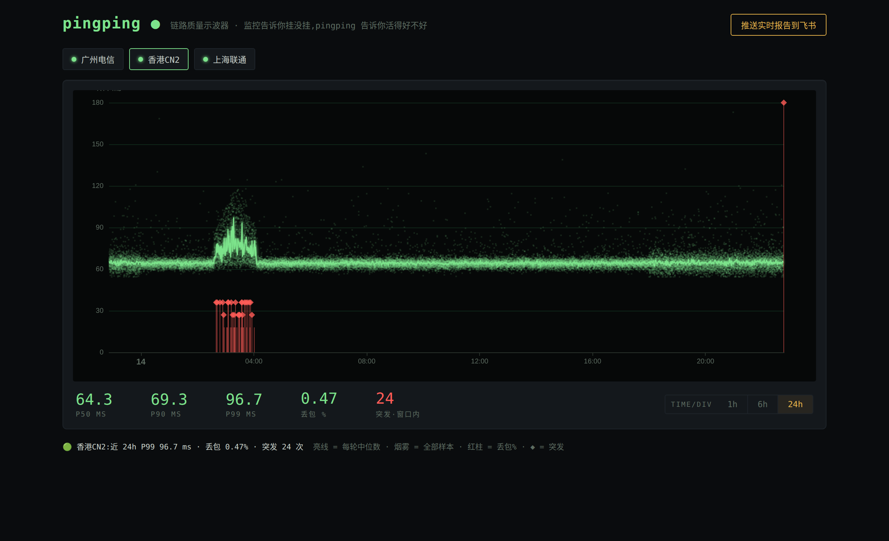
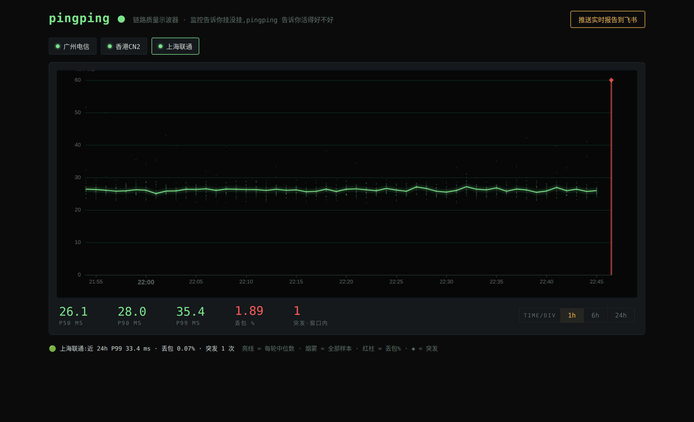

# pingping

> **监控告诉你挂没挂,pingping 告诉你活得好不好。**
> 用户说"卡",监控全绿 —— 故障藏在 RTT 分布和丢包突发里,而 up/down 类工具的数据模型在数学上就看不见它。

pingping 是一个网络链路质量示波器:每轮发 20 个探测包,把**全部样本**画成烟雾图(Smokeping 的可视化语义),用 robust z-score 自动判定丢包突发和 P99 劣化,结论直接推进飞书。

A single-binary network link quality oscilloscope — modern Smokeping semantics, zero dependencies, air-gapped friendly, conclusions-first Feishu alerting.


| 24h 视图:昨晚的劣化窗口 + 晚高峰抖动 | 健康链路就是一条细亮线 |
|---|---|
|  |  |

*(截图为内置回放机制生成的演示数据)*

## 特性

- **单二进制,零依赖** — 纯 Go 标准库,`go.mod` 里没有一行 require。Web UI(ECharts)内嵌,存储是 JSONL 文本文件。没有 Docker、没有数据库、没有 Prometheus,scp 一个文件就能在隔离网跑
- **存分布,不存均值** — 每轮 20 包的原始 RTT 全部落盘。P50/P90/P99、烟雾图、突发标注都从真实分布算出,均值抹平的故障在这里现形
- **免 root** — unprivileged ICMP(`SOCK_DGRAM`)优先,自动回退 raw socket(cap_net_raw)
- **结论先行** — 告警不甩图表,直接说话:"P99 基线 45.2ms → 当前 131.0ms(+190%),近 30 分钟丢包突发 3 次"
- **四类消息,推拉对称** — 告警(有事才响)· 恢复 · 周心跳(证明自己活着,给沉默赋予语义)· 报告(日报可选 + Web 一键手动拉取)

## 快速开始

```bash
# 1. 构建(或从 Releases 下载)
go build -o pingping .

# 2. 配置
cp config.example.jsonc pingping.jsonc && vi pingping.jsonc   # 填 targets 和飞书 webhook

# 3. 运行
./pingping -c pingping.jsonc
# 浏览器打开 http://<host>:8517 看烟雾图
```

无 root 环境需要放开 unprivileged ICMP(多数发行版默认已放开):

```bash
sysctl -w net.ipv4.ping_group_range="0 2147483647"
# 或者给二进制授权 raw socket:
setcap cap_net_raw+ep ./pingping
```

## 读图

- **亮线** = 每轮中位数;**烟雾** = 该轮全部样本 —— 烟越宽,抖动越大
- **红柱** = 该轮丢包率;**◆** = 被 z-score 判定的丢包突发
- 健康链路是一条细亮线;劣化链路是一团散开的烟

## 告警规则(v1 两条,刻意少)

| 规则 | 判定 | 升级条件 |
|---|---|---|
| 丢包突发 | 单轮丢包数对 4h 历史的 robust z-score(中位数+MAD)≥ 3.5 | 30 分钟内 ≥ 3 次 |
| P99 劣化 | 近 15 分钟 P99 > 1 小时前基线 × 1.5 且增量 ≥ 10ms | 连续 3 次确认 |

冷却 30 分钟,持续正常 15 分钟发恢复通知。阈值都可配,默认值即最佳实践。

## 按目标分档

不同链路值得不同的对待,每个目标可选三个旋钮:

| 旋钮 | 档位 | 含义 |
|---|---|---|
| `pace` | `fast` / `normal` / `slow` | 15s(每轮 30 包)/ 60s / 300s;显式 `interval_sec` 优先级最高 |
| `sensitivity` | `strict` / `normal` / `relaxed` | 早叫(核心链路)/ 默认 / 少叫(天生就抖的公网链路) |
| `alerts` | `false` | 纯观测:烟雾图和突发标记照常,永远不推告警 |

目标还可以带 `extra` 自定义字段(如机房、负责人、runbook 链接),与全局 `extra` 合并后渲染进告警卡片 —— 收到告警的人不用再查这条链路归谁管。

## 消息路由与安全

每个 webhook 可配 `kinds` 白名单(`alert` `recovery` `heartbeat` `daily` `manual`),告警进运维群、日报进领导群互不打扰;开启了飞书"签名校验"的机器人填 `secret` 即可,签名自动计算。若机器人使用"自定义关键词"模式,关键词填 `pingping`(所有卡片标题均含)。告警卡片自带来源实例、目标地址、开始时间与持续时长。

## 数据即文本

```
data/
├── 广州电信/2026-07-13.jsonl   # 原始层:每轮一行,14 天后整文件删除
│   {"t":1752390000,"s":20,"r":19,"ms":[12.1,12.3,...],"b":false}
└── summary/广州电信.jsonl       # 汇总层:每天一行,永久保留
    {"d":"2026-07-12","p50":12.3,"p99":45.1,"loss":0.3,"rounds":1440,"bursts":2}
```

可以 `grep`,可以 `jq`,可以 `tar`,永远不会"数据库坏了打不开"。

## 它不做什么

- 不做 up/down 状态页、不做 91 种通知渠道 —— 那是 [Uptime Kuma](https://github.com/louislam/uptime-kuma) 的领域,两者并存互补
- 不做 HTTP 内容断言、证书检查 —— 这里只关心链路本身
- v1 仅 IPv4、单节点多目标;多节点 mesh 互测在路线图上

## 前身

本项目继承自 ai-sreagent(完整代码在本仓库 git history 中):robust z-score 异常检测、飞行记录器、结论先行的告警哲学来自那里 —— LLM 诊断循环被确定性规则引擎替代,三组件架构被压缩成一个二进制。同门项目:[deltascope](https://github.com/githubflyideas/deltascope)(air-gapped 性能回归对比)。

## 赞助

pingping 的目标是"不赔钱地存在"。如果它帮你抓到过一次"监控全绿但就是卡"的元凶:

- ⭐ Star 是最好的支持
- [GitHub Sponsors](https://github.com/sponsors/githubflyideas) · 爱发电(筹备中)
- **赞助位虚位以待** —— README 此处与推送卡片底部各有一个固定展示位(内容将明确标注"推广"),适合 VPS / IDC / 网络服务商,联系方式见 GitHub 主页

## License

MIT
