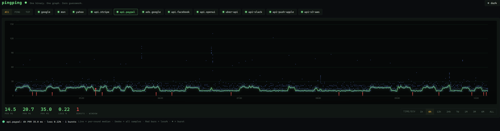
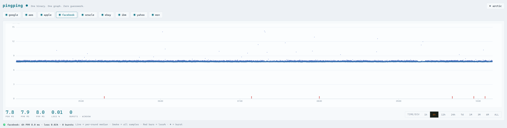

🌐 [English](#english) · [中文](#中文) · [Español](#español) · [Français](#français) · [Português](#português) · [Deutsch](#deutsch) · [Русский](#русский) · [日本語](#日本語) · [한국어](#한국어) · [Bahasa Indonesia](#bahasa-indonesia) · [Tiếng Việt](#tiếng-việt) · [العربية](#العربية) · [हिन्दी](#हिन्दी) · [বাংলা](#বাংলা) · [اردو](#اردو) · [Türkçe](#türkçe) · [ไทย](#ไทย)





A smokeping-like network tool.One binary file,
Just scp and run

```bash
cd /home
wget https://github.com/githubflyideas/pingping/releases/download/v2.11.2/pingping-v2.11.2-linux-amd64.tar.gz

tar -zxvf pingping-v2.11.2-linux-amd64.tar.gz

cd pingping-v2.11.2-linux-amd64
./pingping user=admin passwd=admin
```
Open http://localhost:8517 and watch your first puff of network smoke.

-----------------------------------------------------------
Add target host 
```
 echo "1.2.3.4 myhost pace=fast"    >> targets/ping.list
 echo "10.0.0.5:443 ads-api"        >> targets/tcp.list
```
Data cleanup
Retention is fixed at 300 days. To purge earlier by hand, the bundled `clean.sh` is all you need
(data is plain per-day JSONL, so cleanup is just find+delete):

```
# clean.sh [N] — delete pingping probe data older than N days (default 30).
# Data files are plain per-day JSONL under ./data/<target>/YYYY-MM-DD.jsonl,
# so cleanup is just find+delete. Run from the pingping directory.
days="${1:-30}"
find ./data -type f -name '20*.jsonl' -mtime +"$days" -print -delete    
```
Latest [Releases](https://github.com/githubflyideas/pingping/releases)   

## English

PingPing is a lightweight network latency and link quality visualization tool.

It may not be as powerful or feature-rich as Smokeping, but it's ridiculously lightweight.

Single binary
No Docker
No make. Just scp and run.
No database
Plain text configuration. Edit targets with your favorite editor—or even a single echo command.

Download it, extract it, run ./pingping, then go grab a coffee.

When you're back, open http://localhost:8517 and watch your first puff of network smoke.


apache 2.0
