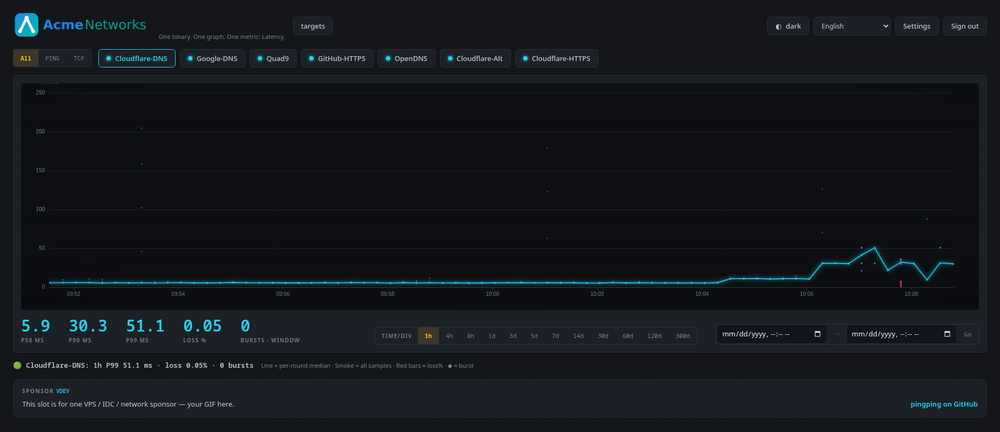
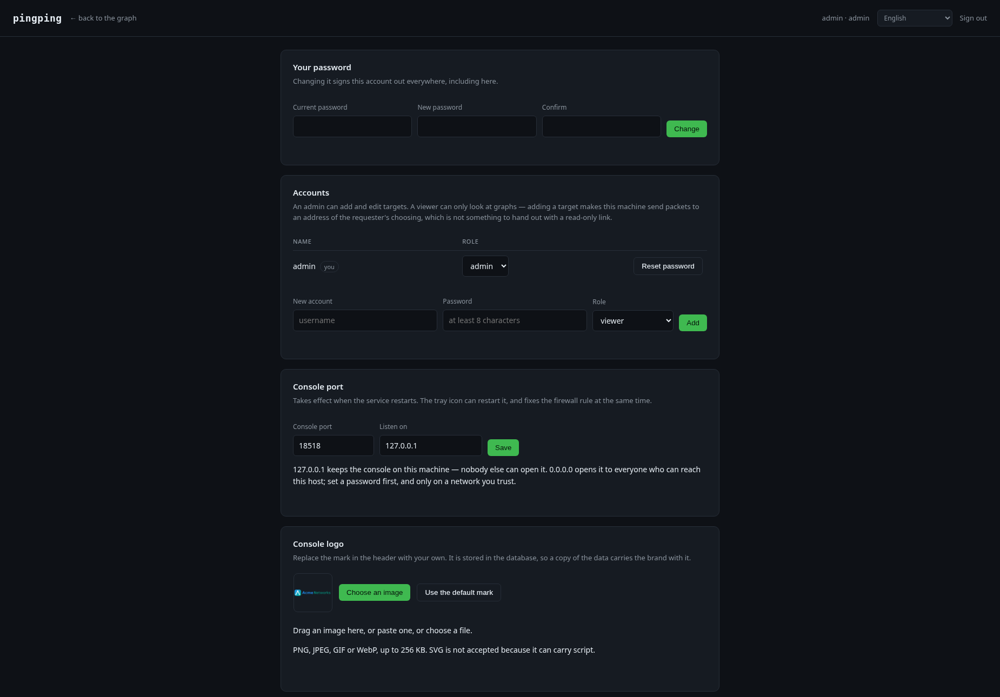
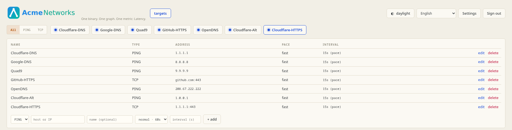

# pingping

> A modern, lightweight, and cross-platform SmokePing alternative.

pingping provides long-term network performance monitoring, tracking latency, jitter, and packet loss with clear, user-friendly charts. 

It runs seamlessly across **Windows**, **Linux**, and **macOS**.






## Download & Quick Start

### Linux (amd64)

```bash
cd /home/
wget https://github.com/githubflyideas/pingping/releases/download/v0.7.4/pingping-linux-amd64
mv pingping-linux-amd64 pingping && chmod +x pingping
./pingping --port 8518
# Open http://localhost:8518
```

### Windows

[pingping-0.7.4-setup.exe](https://github.com/githubflyideas/pingping/releases/download/v0.7.4/pingping-0.7.4-setup.exe)

### macOS (Apple silicon)

[pingping-darwin-arm64](https://github.com/githubflyideas/pingping/releases/download/v0.7.4/pingping-darwin-arm64)

### Export / import targets

In the console, **✎ targets → ⇩ export** downloads the active targets as `pingping-targets-YYYYMMDD.json`; **⇧ import…** (or dropping a file on the panel) shows a preview — what will be added, skipped because the name already exists, or rejected and why — before anything changes. Import only adds: existing targets are never changed or removed, and the whole file is applied in one go or not at all. Export is open to every signed-in account; import is admin-only. The same file works in [fogping](https://github.com/githubflyideas/fogping).

```json
{
  "format": "netping-targets",
  "version": 1,
  "name": "Japan top 3",
  "targets": [
    {"name": "Google JP", "type": "tcp", "host": "www.google.co.jp", "port": 443, "pace": "normal"},
    {"name": "Gateway", "type": "ping", "host": "10.0.0.1", "pace": "fast", "interval": 10}
  ]
}
```

`type` is `ping` or `tcp`, `port` is for tcp only, `pace` is `fast` / `normal` / `slow`, `interval` (seconds) is optional. Importing makes this host probe every address in the file, so only import lists you trust. Full spec: [docs/targets-format.md](docs/targets-format.md) · JSON Schema: [docs/targets.schema.json](docs/targets.schema.json).

---

### ✨ Key Features

* 📊 **Latency & Packet Loss Visualization**: Displays historical ping trends and packet loss density using clear, SmokePing-style chart visualizations.
* 🌐 **Cross-Platform Support**: Native binary builds for Windows, Linux, and macOS without complex runtime dependencies.
* 🛠️ **Simple Configuration & Quick Setup**: Straightforward configuration allowing you to start monitoring target hosts within minutes.
* 📈 **Multi-Target Tracking**: Continuously monitors multiple IP addresses, domains, or gateways in parallel.
* ⚡ **Resource Efficient**: Built for continuous background operation with minimal CPU and memory usage.

---

### 💡 Common Use Cases

* **Server & Node Monitoring**: Track network quality across distributed servers and cloud instances.
* **Troubleshooting**: Diagnose home or office network instability, VPN drops, or ISP packet loss over custom time ranges.
* **Route & Line Comparison**: Compare route stability across different ISPs or nodes over 24-hour periods.

---

### Sponsor slot

The sponsor box in the web UI shows up to four images from [githubflyideas/ads-sponsor](https://github.com/githubflyideas/ads-sponsor). The program itself fetches them from GitHub about once an hour and caches them in a `sponsor` folder inside its data directory; if that cache is empty, the browser may fetch them from GitHub directly. If neither works, the built-in sponsor text is shown. This is the only outbound request pingping makes besides your probes, and it sends nothing about your machine or targets. To turn it off — server and browser both — start with `--no-sponsor` (or `pingping install --no-sponsor` for the service).

---

## License Terms

pingping is licensed under the [Elastic License 2.0](LICENSE). Versions up to and including v0.5.9 were released under the Apache License 2.0.


pingping is free for any individual or organization, including commercial use, provided that the original logo, project name, and author attribution are retained.

The only paid option: replacing the original logo with a custom or corporate logo requires a one-time payment of $12 for a perpetual license.

Selling, reselling, renting, or offering pingping as a paid service to others is prohibited.

To purchase a license, contact the author: route66traffic66@gmail.com
